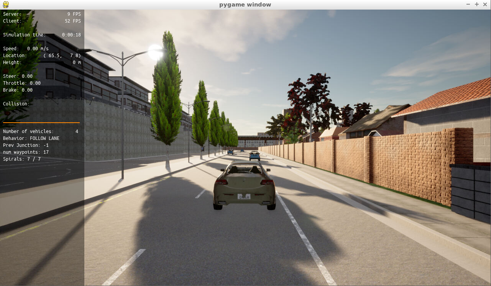
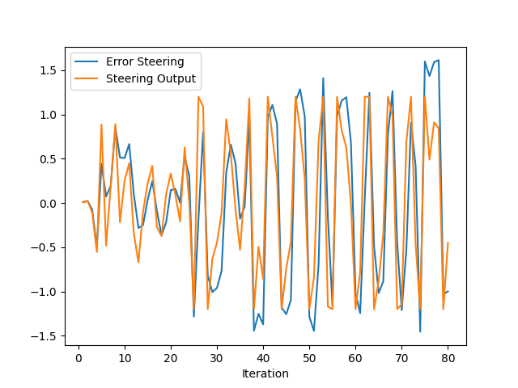
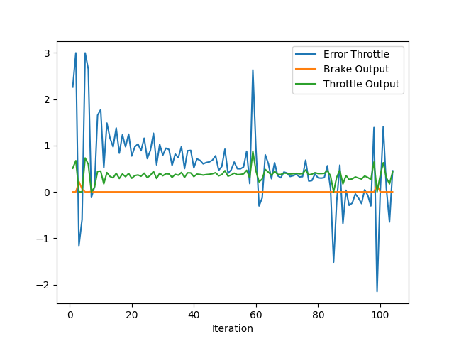

After building the project, the vehicle appears in the scene in the CARLA simulator. 

### 1. Add the plots to your report and explain them (describe what you see)

Here are the steering and throttle error plots as the vehicle drives down the road in this simulation. 

From the above plots, we can see that both errors are at a reasonable magnitude. The brake and throttle outputs are able to stabilize after a transient period, but the steering output oscillates a lot and often saturates at its limits. If one were to sit in a vehicle with this behavior, the comfort would leave much to be desired. 

### 2. What is the effect of the PID according to the plots, how each part of the PID affects the control command?

The P term of the controller adjusts the actuation in proportion to the magnitude of the current error. A P gain too low would make the control command insufficient to correct errors, whereas a P gain too large would result in overshoot and lead to instability. 

The I term adjusts the control command based on accumulated error over time. This is used to correct for steady-state errors. 

The D term is a function of the rate of change in the control command. It acts as a damper against the direction of change, and is helpful for reducing overshoots and improves stability of the vehicle overall. 

### 3. How would you design a way to automatically tune the PID parameters?

The twiddle algorithm is a good starting point. After running the simulation with some initial parameters, evaluate the metrics based on theresults, tweak parameters in the right directions by some proportion, and run again. If there is a known upper and lower limit of a parameter, binary search is also another option to automatically run the simulation and tune the PID parameters. 

### 4. PID controller is a model free controller, i.e. it does not use a model of the car. Could you explain the pros and cons of this type of controller?

Pro: It is a theoretically straightforward controller that is also computationally efficient. There are relatively few parameters to tune, which makes for quick prototyping.  

Con: It is difficult to model and predict the system's output if the system itself is treated as a black-box. If the system to be controlled is highly nonlinear, it may be difficult to tune the parameters to achieve acceptable behavior. 

### 5. What would you do to improve the PID controller?

When tuning the PID parameters, the discretization of my parameter search space was very rough. I would devote more time into fine-tuning the parameters with a smaller search space and smaller step changes. I would also find a way to display the waypoints and planned trajectory in real time in the simulation to help with visualization. 
